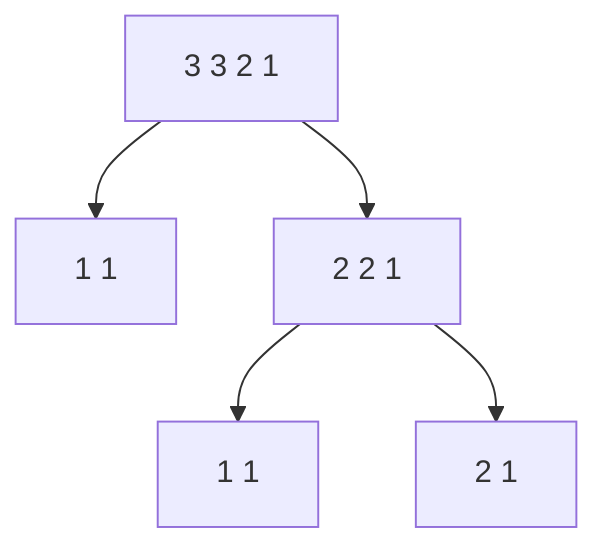
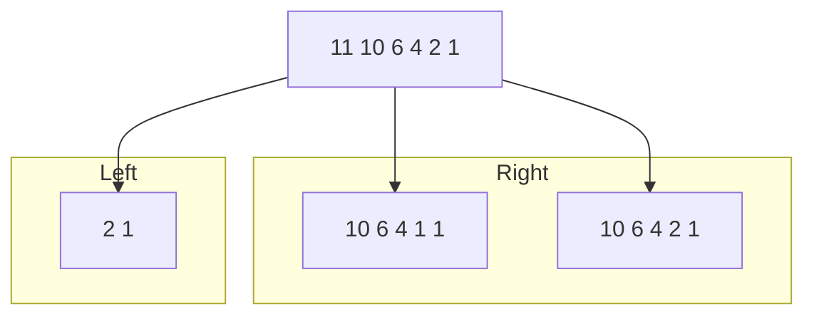
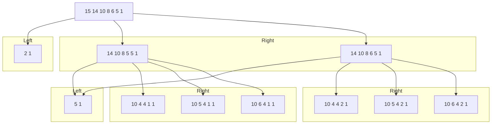

# PDilation is non-injective and non-cancellativite
Like how Dilation is non-injective, PDilation is also non-injective. Hence, finding all `(A, B)` pairs that lead to a known result `Cs` is a set-inversion problem.
It's a nonlinear algebraic structure like (A, B) ↦ A ⊕ B  (where ⊕ is PDilation).
# Redefine PDilation
Assume that A ⊕ B = Cs. We can define PDilation as follow:
Cs(k) = max( A(i) + B(j) ) for all possible i + j = k - 1
This is exactly max-plus convolution, which is:
- Nonlinear
- Non-injective (i.e., multiple inputs can map to the same output)
- Associative
- Commonly used in morphological image processing and tropical algebra.

From here, we can infer that Cs(1) is always equal to A(1) + B(1) as it's the only value used to calculate Cs(1). The same thing with Cs(end) where A(end) + B(end) is the only value being used to calculate Cs(end).
# divide-and-conquer method may not be applicable in the case of reversedPDilation
The original problem is this:
Given D, find all (A, B) such that A ⊕ B = D.  
Whis is exactly like convolution inversion but under max-plus algebra. Because PDilation is non-injective (considering some special cases below), the normal divide-and-conquer method may not be applicable. However, considering the associative and commutative properties, we may be able to apply this method.
# Some special cases:
## Case 1: A ⊕ B = A ⊕ C where B ≠ C
- Example code:
  ```matlab
  disp(ImageProcessor.reversedPDilationv2([11    10     9     8     4     2]));
  ```
- Run the code:
  ```matlab
  >> 
    {[            1]}    {[11 10 9 8 4 2]}
    {[            2]}    {[ 10 9 8 7 3 1]}
    {[          2 1]}    {[   10 8 8 4 2]}
    {[          2 1]}    {[   10 9 8 4 2]}
    {[          3 2]}    {[    9 7 7 3 1]}
    {[          3 2]}    {[    9 8 7 3 1]}
    {[        3 1 1]}    {[      9 8 4 2]}
    {[        3 2 1]}    {[      9 8 4 2]}
    {[        4 2 2]}    {[      8 7 3 1]}
    {[        4 3 2]}    {[      8 7 3 1]}
    {[        7 3 1]}    {[      5 4 3 2]}
    {[        8 4 2]}    {[      4 3 2 1]}
    {[      4 3 2 1]}    {[        8 4 2]}
    {[      5 4 3 2]}    {[        7 3 1]}
    {[      8 7 3 1]}    {[        4 2 2]}
    {[      8 7 3 1]}    {[        4 3 2]}
    {[      9 8 4 2]}    {[        3 1 1]}
    {[      9 8 4 2]}    {[        3 2 1]}
    {[    9 7 7 3 1]}    {[          3 2]}
    {[    9 8 7 3 1]}    {[          3 2]}
    {[   10 8 8 4 2]}    {[          2 1]}
    {[   10 9 8 4 2]}    {[          2 1]}
    {[ 10 9 8 7 3 1]}    {[            2]}
    {[11 10 9 8 4 2]}    {[            1]}
  ```
Here, A = `[2 1]`, B = `[9 7 7 3 1]`, and C = `[9 8 7 3 1]`. However, Cs = A ⊕ B = A ⊕ C = `[11    10     9     8     4     2]`.  
### 1st fact:
You should notice that the length of B (or C) is always larger than 2. The reason is that Cs(1) is always equal to B(1) + C(1) as it's the only value used to calculate Cs(1). The same thing with Cs(end) where C(end) + B(end) is the only value being used to calculate Cs(end). If one of these (B(1), C(1), B(end), and C(end)) changes, the original Cs will be change as well without changing A.  
### Fun fact:
If |A| = 1, B is always equal to C. To avoid making things complicated, through out the input partitions used for analysis, their ending value are always be 1. For partitions that doesn't end with value `1`, we can always and only extract one pair of partitions where one of them has the length of 1 and the other has their ending value is `1`. For example, `[4 4 3]` = `[3]` ⊕ `[2 2 1]`. We will only have to focus on how to decompose `[2 2 1]`.  
## Case 2: A = D where (A ⊕ B) ⊕ C = D ⊕ (B ⊕ C) and B and C are constant partitions
- **Atomic partition:** A partition that cannot be written as A ⊕ B for any nontrivial A and B. It's non-decomposable under PDilation operation (⊕). It appears once in all **full** decompositions of the input partition.
- **Constant partitions:** A partition that always appears in every full decomposition of a certain larger partition. It's not necessarily equal to atomic partitions. You can picture it like prime numbers.

**A canonical decomposition is:** A standardized or agreed-upon way of breaking down partitions (or anything complex) so there's only one correct version. For example:
- Always breaking down left-first.
- Always sorting results lexicographically.
- Always extracting the largest atomic partition possible.

With a canonical rule in place, the atomic components of a partition are unique.
- Example code:
  ```matlab
  disp(ImageProcessor.reversedPDilationv2([17    16    12     10     8     7     3]));
  ```
- Run the code:
  ```matlab
    {[                1]}    {[17 16 12 10 8 7 3]}
    {[                2]}    {[ 16 15 11 9 7 6 2]}
    {[                3]}    {[ 15 14 10 8 6 5 1]}
    {[              2 1]}    {[   16 12 10 7 7 3]}
    {[              2 1]}    {[   16 12 10 8 7 3]}
    {[              3 2]}    {[    15 11 9 6 6 2]}
    {[              3 2]}    {[    15 11 9 7 6 2]}
    {[              4 3]}    {[    14 10 8 5 5 1]}
    {[              4 3]}    {[    14 10 8 6 5 1]}
    {[              5 1]}    {[    13 12 6 6 4 3]}
    {[              5 1]}    {[    13 12 7 6 4 3]}
    {[              5 1]}    {[    13 12 8 6 4 3]}
    {[              6 2]}    {[    12 11 5 5 3 2]}
    {[              6 2]}    {[    12 11 6 5 3 2]}
    {[              6 2]}    {[    12 11 7 5 3 2]}
    {[              7 3]}    {[    11 10 4 4 2 1]}
    {[              7 3]}    {[    11 10 5 4 2 1]}
    {[              7 3]}    {[    11 10 6 4 2 1]}
    {[            6 5 1]}    {[       12 6 6 3 3]}
    {[            6 5 1]}    {[       12 6 6 4 3]}
    {[            6 5 1]}    {[       12 7 6 3 3]}
    {[            6 5 1]}    {[       12 7 6 4 3]}
    {[            6 5 1]}    {[       12 8 6 3 3]}
    {[            6 5 1]}    {[       12 8 6 4 3]}
    {[            7 6 2]}    {[       11 5 5 2 2]}
    {[            7 6 2]}    {[       11 5 5 3 2]}
    {[            7 6 2]}    {[       11 6 5 2 2]}
    {[            7 6 2]}    {[       11 6 5 3 2]}
    {[            7 6 2]}    {[       11 7 5 2 2]}
    {[            7 6 2]}    {[       11 7 5 3 2]}
    {[            8 7 3]}    {[       10 4 4 1 1]}
    {[            8 7 3]}    {[       10 4 4 2 1]}
    {[            8 7 3]}    {[       10 5 4 1 1]}
    {[            8 7 3]}    {[       10 5 4 2 1]}
    {[            8 7 3]}    {[       10 6 4 1 1]}
    {[            8 7 3]}    {[       10 6 4 2 1]}
    {[       10 4 4 1 1]}    {[            8 7 3]}
    {[       10 4 4 2 1]}    {[            8 7 3]}
    {[       10 5 4 1 1]}    {[            8 7 3]}
    {[       10 5 4 2 1]}    {[            8 7 3]}
    {[       10 6 4 1 1]}    {[            8 7 3]}
    {[       10 6 4 2 1]}    {[            8 7 3]}
    {[       11 5 5 2 2]}    {[            7 6 2]}
    {[       11 5 5 3 2]}    {[            7 6 2]}
    {[       11 6 5 2 2]}    {[            7 6 2]}
    {[       11 6 5 3 2]}    {[            7 6 2]}
    {[       11 7 5 2 2]}    {[            7 6 2]}
    {[       11 7 5 3 2]}    {[            7 6 2]}
    {[       12 6 6 3 3]}    {[            6 5 1]}
    {[       12 6 6 4 3]}    {[            6 5 1]}
    {[       12 7 6 3 3]}    {[            6 5 1]}
    {[       12 7 6 4 3]}    {[            6 5 1]}
    {[       12 8 6 3 3]}    {[            6 5 1]}
    {[       12 8 6 4 3]}    {[            6 5 1]}
    {[    11 10 4 4 2 1]}    {[              7 3]}
    {[    11 10 5 4 2 1]}    {[              7 3]}
    {[    11 10 6 4 2 1]}    {[              7 3]}
    {[    12 11 5 5 3 2]}    {[              6 2]}
    {[    12 11 6 5 3 2]}    {[              6 2]}
    {[    12 11 7 5 3 2]}    {[              6 2]}
    {[    13 12 6 6 4 3]}    {[              5 1]}
    {[    13 12 7 6 4 3]}    {[              5 1]}
    {[    13 12 8 6 4 3]}    {[              5 1]}
    {[    14 10 8 5 5 1]}    {[              4 3]}
    {[    14 10 8 6 5 1]}    {[              4 3]}
    {[    15 11 9 6 6 2]}    {[              3 2]}
    {[    15 11 9 7 6 2]}    {[              3 2]}
    {[   16 12 10 7 7 3]}    {[              2 1]}
    {[   16 12 10 8 7 3]}    {[              2 1]}
    {[ 15 14 10 8 6 5 1]}    {[                3]}
    {[ 16 15 11 9 7 6 2]}    {[                2]}
    {[17 16 12 10 8 7 3]}    {[                1]}
  ```
In this case, let C = `[2 1]` and B = `[5 1]`.
B ⊕ C = `[6 5 1]`. As we see below, B ⊕ C is in the right side, giving all possible Ds in the left side:
```matlab
    {[       12 6 6 3 3]}    {[            6 5 1]}
    {[       12 6 6 4 3]}    {[            6 5 1]}
    {[       12 7 6 3 3]}    {[            6 5 1]}
    {[       12 7 6 4 3]}    {[            6 5 1]}
    {[       12 8 6 3 3]}    {[            6 5 1]}
    {[       12 8 6 4 3]}    {[            6 5 1]}
```
Let's pick the pair `{[   16 12 10 8 7 3]}    {[              2 1]}` (there's two pairs that satisfy this). Here, C is in the right side. In the left side, A ⊕ B = `[16 12 10 8 7 3]`. Let's decompose this into pairs of partitions using `reversedPDilation`:
```matlab
    {[             1]}    {[16 12 10 8 7 3]}
    {[             2]}    {[ 15 11 9 7 6 2]}
    {[             3]}    {[ 14 10 8 6 5 1]}
    {[           5 1]}    {[    12 6 6 4 3]}
    {[           5 1]}    {[    12 7 6 4 3]}
    {[           5 1]}    {[    12 8 6 4 3]}
    {[           6 2]}    {[    11 5 5 3 2]}
    {[           6 2]}    {[    11 6 5 3 2]}
    {[           6 2]}    {[    11 7 5 3 2]}
    {[           7 3]}    {[    10 4 4 2 1]}
    {[           7 3]}    {[    10 5 4 2 1]}
    {[           7 3]}    {[    10 6 4 2 1]}
    {[    10 4 4 2 1]}    {[           7 3]}
    {[    10 5 4 2 1]}    {[           7 3]}
    {[    10 6 4 2 1]}    {[           7 3]}
    {[    11 5 5 3 2]}    {[           6 2]}
    {[    11 6 5 3 2]}    {[           6 2]}
    {[    11 7 5 3 2]}    {[           6 2]}
    {[    12 6 6 4 3]}    {[           5 1]}
    {[    12 7 6 4 3]}    {[           5 1]}
    {[    12 8 6 4 3]}    {[           5 1]}
    {[ 14 10 8 6 5 1]}    {[             3]}
    {[ 15 11 9 7 6 2]}    {[             2]}
    {[16 12 10 8 7 3]}    {[             1]}
```
As we see below, B is in the right side, giving all possible As in the left side:
```matlab
    {[    12 6 6 4 3]}    {[           5 1]}
    {[    12 7 6 4 3]}    {[           5 1]}
    {[    12 8 6 4 3]}    {[           5 1]}
```
Let's pick the pair `{[   16 12 10 7 7 3]}    {[              2 1]}`, the only pair left to be tested, instead of `{[   16 12 10 8 7 3]}    {[              2 1]}` where C is in the right side and A ⊕ B is in the left side. Let's decompose A ⊕ B:
```matlab
    {[             1]}    {[16 12 10 7 7 3]}
    {[             2]}    {[ 15 11 9 6 6 2]}
    {[             3]}    {[ 14 10 8 5 5 1]}
    {[           5 1]}    {[    12 6 6 3 3]}
    {[           5 1]}    {[    12 7 6 3 3]}
    {[           5 1]}    {[    12 8 6 3 3]}
    {[           6 2]}    {[    11 5 5 2 2]}
    {[           6 2]}    {[    11 6 5 2 2]}
    {[           6 2]}    {[    11 7 5 2 2]}
    {[           7 3]}    {[    10 4 4 1 1]}
    {[           7 3]}    {[    10 5 4 1 1]}
    {[           7 3]}    {[    10 6 4 1 1]}
    {[    10 4 4 1 1]}    {[           7 3]}
    {[    10 5 4 1 1]}    {[           7 3]}
    {[    10 6 4 1 1]}    {[           7 3]}
    {[    11 5 5 2 2]}    {[           6 2]}
    {[    11 6 5 2 2]}    {[           6 2]}
    {[    11 7 5 2 2]}    {[           6 2]}
    {[    12 6 6 3 3]}    {[           5 1]}
    {[    12 7 6 3 3]}    {[           5 1]}
    {[    12 8 6 3 3]}    {[           5 1]}
    {[ 14 10 8 5 5 1]}    {[             3]}
    {[ 15 11 9 6 6 2]}    {[             2]}
    {[16 12 10 7 7 3]}    {[             1]}
```
As we see below, B is in the right side, giving all possible As in the left side (which is the same as the case where A ⊕ B = `[16 12 10 7 7 3]`):
```matlab
    {[    12 6 6 3 3]}    {[           5 1]}
    {[    12 7 6 3 3]}    {[           5 1]}
    {[    12 8 6 3 3]}    {[           5 1]}
```
### 2nd fact:
We can clearly see that A = D. Combining with the 1st fact, this may suggest that divide-and-conquer is applicable. Potentially, a tree-based modeling may be used to:
- Backtracking search for all valid decompositions.
- Memoization to avoid redundant recomputation.
- Potential pruning strategies based on boundary constraints (e.g., Cs(1) = A(1) + B(1))
## Case 3: A can't be decomposed if |A| < 3 where A is a partition
- **Definition:** If a partition C is able to be decomposed, there must exist a pair A & B (A ⊕ B = C) where |A| > 1 and |B| > 1.
- Example code:
  ```matlab
  disp(ImageProcessor.reversedPDilationv2([4 2 1]));
  ```
- Run the code:
  ```matlab
  >>
    {[    1]}    {[4 2 1]}
    {[4 2 1]}    {[    1]}
  ```
In this case, `[4 2 1]` can't be decomposed any further. Nevertheless, instead of trial-and-error, how can we know if it's decomposable using mathematics principle?
Let's make things easier. Can we create a non-decomposable partition with 2 non-decomposable partition? This reminds me of [prime sieve](https://en.wikipedia.org/wiki/Sieve_of_Eratosthenes) algorithm. We can picture decomposing a partition like factorizing a number. Although `PDilation` is non-injective, it's associative and commutative. Hence, it's possible to generate a *partition sieve* table for **full** decomposition of C:
- Generate all integer partitions up to some n with the same length `l`
- Initialize all as "possibly prime" (indecomposable)
- Then for each known partition A and B where |A| < `l+1` and |B| < `l+1`, try:
  - Compute A ⊕ B = D where |D| < |C| + 1
  - Mark D as composite (i.e., decomposable)

Still, we have to loop through the table like the normal recursion method do. However, we don’t need to loop through the full length of partition C — we only need to consider up to half of it, similar to how checking for primality of `n` only requires looping up to `√n`. Because if C were decomposable, it must break into smaller valid partitions — and at least one of them must be non-decomposable (i.e., irreducible). If none of these show up as potential components, the original must be atomic too.  
### Why Finding Atomic Partitions Help
How does finding non-decomposable partitions of another partition help?  
- Consider **2nd fact (A = D where (A ⊕ B) ⊕ C = D ⊕ (B ⊕ C) and B and C are constant partitions):** We can clearly see that A = D in the case 2. And, thanks again to the associative and commutative properties, we know that these non-decomposable partitions are atomic partitions, meaning they exist once in all **full** decompositions of the input partition.  
- Applying the **1st fact** (A ⊕ B = A ⊕ C where B ≠ C) and the fact that we don't have to worry about whether A exists in a **full** decomposition, we can just focusing on decomposing B and C instead.

The first step is to generate a *partition sieve* table to find all possible atomic partitions that may help construct the input partition. In the next step, we find all possible partitions B and C where A ⊕ B = A ⊕ C, A is a atomic partition, and B ≠ C. In fact, it may have more than just B and C or just one possible partition.
We can use tree-based modeling to generate the **full** decomposition of the input partition. In the below demonstration, the "Left" groups are guaranteed atomic partitions and only have 1 partitions. The "Right" groups may contain multiple partitions. Let's consider a simple case first:

- And, all possible pairs of partitions of `[3 3 2 1]` are these:
```matlab
    {[      1]}    {[3 3 2 1]}
    {[    1 1]}    {[  3 2 1]}
    {[    2 1]}    {[  2 2 1]}
    {[  2 2 1]}    {[    2 1]}
    {[  3 2 1]}    {[    1 1]}
    {[3 3 2 1]}    {[      1]}
    Size: 6
```
- A more complex case:

- And, all possible pairs of partitions of `[11 10 6 4 2 1]` are these:
```matlab
    {[            1]}    {[11 10 6 4 2 1]}
    {[          2 1]}    {[   10 6 4 1 1]}
    {[          2 1]}    {[   10 6 4 2 1]}
    {[   10 6 4 1 1]}    {[          2 1]}
    {[   10 6 4 2 1]}    {[          2 1]}
    {[11 10 6 4 2 1]}    {[            1]}
    Size: 6
```
- An even more complex case:

- And, all possible pairs of partitions of `[15 14 10 8 6 5 1]` are these:
```matlab
    {[               1]}    {[15 14 10 8 6 5 1]}
    {[             2 1]}    {[   14 10 8 5 5 1]}
    {[             2 1]}    {[   14 10 8 6 5 1]}
    {[             5 1]}    {[   11 10 4 4 2 1]}
    {[             5 1]}    {[   11 10 5 4 2 1]}
    {[             5 1]}    {[   11 10 6 4 2 1]}
    {[           6 5 1]}    {[      10 4 4 1 1]}
    {[           6 5 1]}    {[      10 4 4 2 1]}
    {[           6 5 1]}    {[      10 5 4 1 1]}
    {[           6 5 1]}    {[      10 5 4 2 1]}
    {[           6 5 1]}    {[      10 6 4 1 1]}
    {[           6 5 1]}    {[      10 6 4 2 1]}
    {[      10 4 4 1 1]}    {[           6 5 1]}
    {[      10 4 4 2 1]}    {[           6 5 1]}
    {[      10 5 4 1 1]}    {[           6 5 1]}
    {[      10 5 4 2 1]}    {[           6 5 1]}
    {[      10 6 4 1 1]}    {[           6 5 1]}
    {[      10 6 4 2 1]}    {[           6 5 1]}
    {[   11 10 4 4 2 1]}    {[             5 1]}
    {[   11 10 5 4 2 1]}    {[             5 1]}
    {[   11 10 6 4 2 1]}    {[             5 1]}
    {[   14 10 8 5 5 1]}    {[             2 1]}
    {[   14 10 8 6 5 1]}    {[             2 1]}
    {[15 14 10 8 6 5 1]}    {[               1]}
    Size: 24
```
