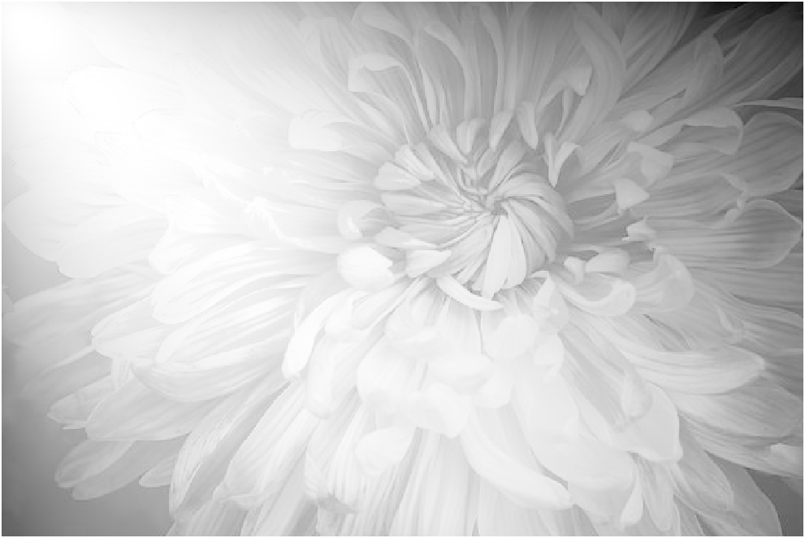
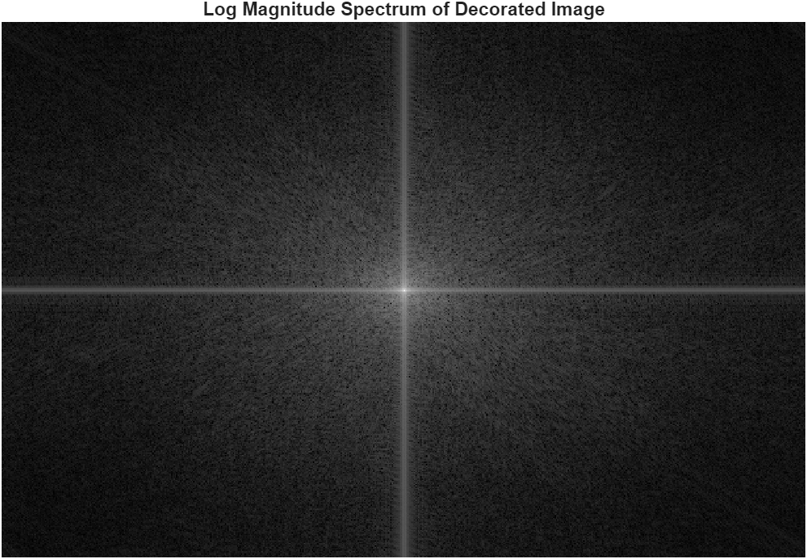
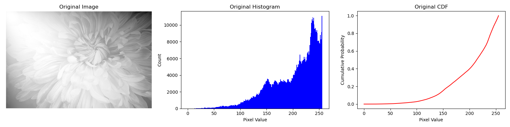

# Derivatives
## Original Image
- MATLAB code:
  ```matlab
  img = imread('test.png');
  img = rgb2gray(img);
  decorated = double(img);
  imshow(img);
  
  I_min = min(decorated(:));
  I_max = max(decorated(:));
  decorated = (decorated - I_min) / (I_max - I_min);
  
  % Compute FFT
  F = fftshift(fft2(decorated));
  magnitude = abs(F);
  
  % Show spectrum
  figure;
  imshow(log(1 + magnitude), []);
  title('Log Magnitude Spectrum of Decorated Image');
  ```
- Image: 
- DCT Image: 
## Poisson Image
- MATLAB code:
  ```matlab
  img = imread('test.png');
  img = rgb2gray(img);
  decorated = ImageProcessor.transform(img, 'no');
  
  I_min = min(decorated(:));
  I_max = max(decorated(:));
  decorated = (decorated - I_min) / (I_max - I_min);
  
  % Compute FFT
  F = fftshift(fft2(decorated));
  magnitude = abs(F);
  
  % Show spectrum
  figure;
  imshow(log(1 + magnitude), []);
  title('Log Magnitude Spectrum of Decorated Image');
  ```
- Image: 
- DCT Image: 
## Poisson Image with Cosine
We apply this function on the Poisson image: `abs(cos(<intensity>))`  
- MATLAB code:
  ```matlab
  img = imread('test.png');
  img = rgb2gray(img);
  decorated = ImageProcessor.transform(img, 'cos');
  
  I_min = min(decorated(:));
  I_max = max(decorated(:));
  decorated = (decorated - I_min) / (I_max - I_min);
  
  % Compute FFT
  F = fftshift(fft2(decorated));
  magnitude = abs(F);
  
  % Show spectrum
  figure;
  imshow(log(1 + magnitude), []);
  title('Log Magnitude Spectrum of Decorated Image');
  ```
- Image: 
- DCT Image: 
## Poisson Image with Cosine v2
We apply this function on the Poisson image: `(cos(<intensity>) + 1) / 2`  
- MATLAB code:
  ```matlab
  img = imread('test.png');
  img = rgb2gray(img);
  decorated = ImageProcessor.transform(img, 'cos2');
  
  I_min = min(decorated(:));
  I_max = max(decorated(:));
  decorated = (decorated - I_min) / (I_max - I_min);
  
  % Compute FFT
  F = fftshift(fft2(decorated));
  magnitude = abs(F);
  
  % Show spectrum
  figure;
  imshow(log(1 + magnitude), []);
  title('Log Magnitude Spectrum of Decorated Image');
  ```
- Image: 
- DCT Image: 
## Poisson Image with Cosine v3
We apply this function on the Poisson image: `cos(pi / (2 * scale * val))`  
- MATLAB code:
  ```matlab
  img = imread('test.png');
  img = rgb2gray(img);
  decorated = ImageProcessor.transform(img, 'cos3', 1 / (size(img,1) * size(img,2)));
  
  I_min = min(decorated(:));
  I_max = max(decorated(:));
  decorated = (decorated - I_min) / (I_max - I_min);
  
  % Compute FFT
  F = fftshift(fft2(decorated));
  magnitude = abs(F);
  
  % Show spectrum
  figure;
  imshow(log(1 + magnitude), []);
  title('Log Magnitude Spectrum of Decorated Image');
  ```
- Image: 
- DCT Image: full of NaN (could be due to sharp increases in pixels leading to very large frequencies values).
## Poisson Image with Sigmoid
We apply this function on the Poisson image: `1 / (1 + exp(-scale * (<intensity> - threshold)))`  
- MATLAB code:
  ```matlab
  img = imread('test.png');
  img = rgb2gray(img);
  decorated = ImageProcessor.transform(img, 'sigmoid', 1 / (size(img,1) * size(img,2)), 0);
  
  I_min = min(decorated(:));
  I_max = max(decorated(:));
  decorated = (decorated - I_min) / (I_max - I_min);
  
  % Compute FFT
  F = fftshift(fft2(decorated));
  magnitude = abs(F);
  
  % Show spectrum
  figure;
  imshow(log(1 + magnitude), []);
  title('Log Magnitude Spectrum of Decorated Image');
  ```
- Image: 
- DCT Image: 
## Poisson Image with Log
We apply this function on the Poisson image: `log(1 + scale * (<intensity> - threshold))`  
- MATLAB code:
  ```matlab
  img = imread('test.png');
  img = rgb2gray(img);
  decorated = ImageProcessor.transform(img, 'log', 1 / (size(img,1) * size(img,2)), 0);
  
  I_min = min(decorated(:));
  I_max = max(decorated(:));
  decorated = (decorated - I_min) / (I_max - I_min);
  
  % Compute FFT
  F = fftshift(fft2(decorated));
  magnitude = abs(F);
  
  % Show spectrum
  figure;
  imshow(log(1 + magnitude), []);
  title('Log Magnitude Spectrum of Decorated Image');
  ```
- Image: 
- DCT Image: 
# Multinomial Log-PMF for Grayscale Images
Explores how a multinomial probability model can be used to transform a grayscale image into a new representation that combines position and intensity as pseudo-counts
## Model Idea
Each pixel is treated as a ``sample'' described by:
- x → horizontal coordinate (range: 0 to 400) (could be different)
- y → vertical coordinate (range: 0 to 600) (could be different)
- t → grayscale intensity (range: 0 to 255) (could be double value ranging from 0 to 1)
- The sum: S=x+y+t
## Multinomial Log-PMF
We interpret this triplet as pseudo-counts in a multinomial distribution:
`lnP(x,y,t)=ln(S!)−ln(x!)−ln(y!)−ln(t!)+xln(x/S)+yln(y/S)+tln(t/S)`

- Optional: To recover the actual multinomial probability: `P(x, y, t) = exp(<ln P>)`. This gives the true probability. In practice, it’s usually extremely tiny — so the **log-space version** is what you visualize.

**Below:**  
These example outputs show how the original version behaves:

- **Decorated (Raw Multinomial PMF)**  
  

- **FFT Spectrum of the PMF**  
  

- **Histogram of the PMF**  
  

The PMF itself is nearly zero for most pixels — only the log-PMF reveals the structure clearly:
- The decorated image (log-PMF): 
- The FFT spectrum (frequency content of the transform): 
- The histogram + CDF of the log-PMF values: 
## Multinomial Log-PMF vs Probability

```matlab
% MATLAB example
decorated = ImageProcessor.multinomialLog(img2, img);
```

* **img2** → the grayscale image → provides `t` (pixel intensity)
* **img** → the RGB image → provides `p1, p2, p3` at each pixel (normalized)

**For each pixel:**

ln P(x, y, t) = ln(S!) - ln(x!) - ln(y!) - ln(t!) + x ln(p1) + y ln(p2) + t ln(p3)

where S = x + y + t.

**Normalization:**

p1 = R / Sr,  p2 = G / Sr,  p3 = B / Sr,  where Sr = R + G + B.

---

### `decorated` vs `exp(decorated)`

* **`decorated`** → the raw log-PMF → usually negative, because log-probabilities of tiny values are negative.
* `imshow(decorated, [])` may look dark — so always normalize first:

```matlab
I_min = min(decorated(:));
I_max = max(decorated(:));
decorated = (decorated - I_min) / (I_max - I_min);
imshow(decorated, []);
```

* **`exp(decorated)`** → gives you the real multinomial probability:

P(x,y,t) = exp(ln P)

But P can be tiny → so only strong regions appear visible.

---

| Original Grayscale     | Reference Image (colored) | Log-PMF (shifted)               | `exp` version (original multinomial)               | FFT (original multinomial)                            |
| ---------------------- | ------------------------- | ------------------------------- | -------------------------------------------------- | ----------------------------------------------------- |
|  |  |  |  |  |

## Multinomial Log vs Fixed Probabilities

This section shows what happens when you compute the **multinomial log PMF** on a grayscale image using **fixed probabilities** for \( p_1, p_2, p_3 \) instead of a color reference image.

### What changes?

In the **original version**, we used:
- `t` = grayscale intensity at each pixel.
- `p_1, p_2, p_3 = RGB` reference fractions at each pixel.
- So each pixel’s log PMF: `ln P(x,y,t) = ln(S!) - ln(x!) - ln(y!) - ln(t!) + x*ln(p_1) + y*ln(p_2) + t*ln(p_3)`

In the **fixed version**, we **force**:
- `p_1, p_2, p_3` to be the **same for all pixels** (e.g. 1/3, 1/3, 1/3) or any other constant.
- So the only varying parts are `( x, y, t )`.

### Example: Fixed `( p_1, p_2, p_3 )`

Below is a sample output when you use **fixed** `( p )`:

| Image | FFT | Histogram + CDF |
|-------|-----|------------------|
|  |  |  |

- **Left:** Decorated image — visible pattern depends on coordinate \((x, y)\) and intensity \( t \).
- **Middle:** FFT shows the frequency structure — patterns often appear near the DC component.
- **Right:** Histogram + CDF show the spread — usually different shape than natural grayscale.
- **Using fixed `p`** → multinomial log is purely combinatorial: same weights everywhere.

### Key equation (fixed)

`ln P(x,y,t) = ln(S!) - ln(x!) - ln(y!) - ln(t!) + x*ln(p_1) + y*ln(p_2) + t*ln(p_3), where p_1 + p_2 + p_3 = 1`
